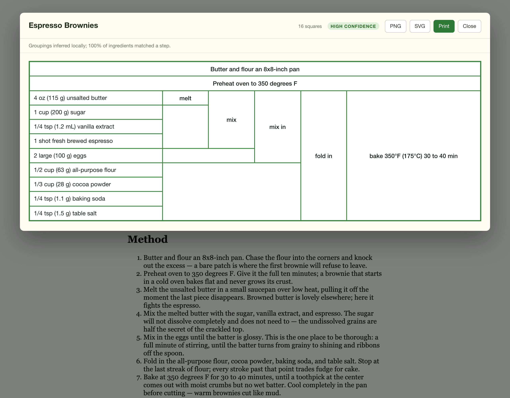

# Reduction

A Chrome extension and command-line tool that turn any recipe page into a
[Cooking For Engineers](https://www.cookingforengineers.com/) style tabular
diagram — ingredients down the left, operations spanning the rows they
consume, the whole thing readable as a timeline.



## Install it

### From a release

Download `reduction-<version>.zip` from the [latest
release](https://github.com/bostonaholic/reduction/releases/latest) and unzip it.
The folder you get is the extension — no build step, no Node.

Then in Chrome: **chrome://extensions** → enable **Developer mode** → **Load
unpacked** → select the unzipped folder (the one holding `manifest.json`).

Chrome loads it from wherever you unzipped it, so keep the folder around;
deleting it uninstalls the extension. To upgrade, download the new zip, unzip
over the old folder, and hit **Reload** on the extension card.

### From source

```sh
npm install
npm run build
```

Same **Load unpacked** steps, but select `dist/`.

Click the toolbar button on any recipe page (or press <kbd>Alt</kbd>+<kbd>Shift</kbd>+<kbd>R</kbd>).
Click it again, or press <kbd>Esc</kbd>, to dismiss.

## Command line

The same pipeline runs from a terminal. The package is private and
unpublished, so the entry path is `npm link` — `npm install` must run first
anyway (jsdom is a runtime dependency), and its `prepare` hook builds
`dist/cli.mjs`, so the bin target exists by the time `npm link` symlinks it.
(`npm ci --ignore-scripts` skips that `prepare` build; run `npm run build`
yourself afterwards.)

```sh
npm install
npm link
reduction 'https://example.com/some-recipe'
```

Or skip the link and run the bundle directly: `node dist/cli.mjs '<url>'`.
Single-quote the URL — recipe URLs are third-party text, and an unquoted one
lets any shell metacharacters in it execute as commands.

Formats: `--format text` (default) prints a box-drawing table at the
terminal's width (100 columns when piped); `--format json` prints the
recipe, grid, and confidence note for scripts and agents; `--format html`
prints the same markup the extension renders — unstyled without the
extension's `overlay.css` around it; `--format svg` prints the same
diagram the extension exports as a standalone SVG image (the confidence
note goes to stderr, never into the artifact); `--format png` prints that
diagram rasterized at 2× — binary output, so redirect it to a file
(`> out.png`); a terminal refuses it. PNG needs the optional
`@resvg/resvg-js` dependency, so installs with `--omit=optional` lose
only that format.

`--claude` opts in to the Claude tier when the local parse is
low-confidence. It reads `ANTHROPIC_API_KEY` and spends your API budget,
so it is never automatic. `--help` prints usage.

For anyone scripting against the CLI, the exit code is part of the
contract: `0` success, `1` operational failure (reason on stderr), `2`
usage error.

Two limitations to know about. Sites that block scripted requests return
403s to the CLI's plain `fetch` where the extension rides a real browser
session — expect exit 1 with the reason on stderr. And the CLI fetches
whatever URL it is given with your network access, localhost and private
addresses included; it does not filter them.

A Claude Code session rooted in this checkout discovers the CLI through the
Skill at `.claude/skills/reduction/SKILL.md`. Other agents: copy that
directory into your own skill location — the Skill reaches only sessions
rooted here, and `npm install` never delivers it.

## How it works

The insight that makes this tractable: **the table is a left-to-right rendering
of a tree.** Ingredients are leaves, operations are internal nodes, and two
rules produce the whole diagram:

    column(node)  = depth from the ingredient leaves
    rowSpan(node) = number of leaves in its subtree

Abridged from the reference brownie recipe — the screenshot above shows the
same recipe with its full nine ingredients:

```
┌────────────────────────────────────────────────────────┐
│ Butter and flour an 8x8-in pan                         │  ← banner rows
├────────────────────────────────────────────────────────┤
│ Preheat oven to 350°F (170°C)                          │
├──────────────────────┬──────┬─────┬─────┬──────┬───────┤
│ 4 oz (115 g) butter  │ melt │     │     │      │       │
├──────────────────────┼──────┤ mix │     │      │ bake  │
│ 1 cup (200 g) sugar  │      │     │ mix │ fold │ 350°F │
│ 1/4 tsp vanilla      │      │     │     │  in  │ 30-40 │
├──────────────────────┼──────┴─────┤     │      │  min  │
│ 2 large (100 g) eggs │            │     │      │       │
├──────────────────────┼────────────┴─────┤      │       │
│ 1/2 cup (80 g) flour │                  │      │       │
└──────────────────────┴──────────────────┴──────┴───────┘
```

Row order comes from a depth-first traversal of the leaves, which is what
guarantees every operation's inputs land in a *contiguous* block of rows — the
only thing a `rowspan` can cover.

The pipeline is five pure functions plus a scraper:

| Stage | Module | Contract |
| --- | --- | --- |
| extract | `src/core/extract.ts` | `Document → RawRecipe` — JSON-LD, then microdata, then DOM heuristics |
| normalize | `src/core/ingredient.ts`, `units.ts` | ingredient lines → quantities, units, metric equivalents |
| infer | `src/core/infer.ts` | flat steps → tree + confidence |
| layout | `src/core/layout.ts` | tree → positioned cells with spans |
| render | `src/core/render.ts` | cells → HTML (the extension and `--format html`) |
| render text | `src/core/render-text.ts` | grid → box-drawing text (the CLI's default output) |

None of them touch `chrome.*`, so the entire product logic is unit-testable in
Node. The extension shell is a thin adapter over the top.

### Working out what each step uses

This is the hard part, and it runs as a three-tier ladder:

1. **Local heuristics** (always, free, offline). Ingredients are matched to
   steps by their most distinctive phrase, longest first — which is what stops
   "baking soda" being claimed by a step that only mentions "baking powder". A
   stack of pending outputs tracks work in progress; a step consumes it when it
   says so ("stir into the batter"), when its verb implies it ("add"), or when
   it introduced no new ingredients and must therefore be acting on something.
2. **Claude** (when local parsing is uncertain — low confidence, or the
   self-check found a structural or faithfulness problem — only with a key you
   supply in the options page). Structured outputs cannot express a recursive
   schema, so the
   model returns a *flat* plan — steps referencing ingredients and earlier steps
   by index — and `src/core/plan.ts` builds the tree from it. That keeps the
   whole Claude path testable without a network call. The model and its effort
   level are picked in the options page — Opus 5 at low effort by default,
   Sonnet 5 and Haiku 4.5 as cheaper and less accurate, Fable 5 if you want the
   best parse and will pay for it.
3. **Flat table** (always works). Every ingredient in column one, each step its
   own column. Never claims to understand the recipe.

The overlay labels its own confidence, so a bad parse is visible rather than
quietly wrong.

## Privacy and permissions

`activeTab` + `scripting`, so the extension can only read a page you explicitly
clicked the button on — there is no broad host access. The single host
permission is `api.anthropic.com`, used only for tier 2, only when you have
saved a key, and only when local parsing is uncertain. No key means nothing ever
leaves your machine.

## Development

```sh
npm run dev        # esbuild watch
npm test           # unit + fixture golden tests
npm run report     # per-site quality report (confidence, tree depth, shape)
npm run e2e        # loads the extension in Chromium, runs against live sites
npm run capture    # refresh the local HTML fixtures
npm run screenshot # regenerate the README screenshot; re-run after any
                   # change to the overlay's look
```

The browser-based scripts (`npm run e2e`, `npm run screenshot`) need
Playwright's browser installed once: `npx playwright install chromium`.
Regenerate the screenshot on macOS — like the `-darwin`-suffixed golden
references, the committed image is pinned to macOS font rasterization.

`npm run report` is the useful one while tuning inference — pass/fail tells you
nothing broke, the report tells you whether the output is any good:

```
foodnetwork     json-ld  ing 11  steps 6  banners 1  depth 5  12x6  conf 100%  ok
                ops: scoop 15 min | drop 1 hr | whisk 30 sec | sift 2 min | melt
```

### Tests

- **`tests/core/layout.test.ts`** pins the layout engine against the reference
  brownie diagram — exact rowspans, column indices, filler merging, row order.
  If it passes, the renderer reproduces a real Cooking For Engineers table.
- **`tests/sites.test.ts`** runs the pipeline over HTML captured from 15 real
  recipe sites. Fixtures are third-party page copies, so they are generated
  locally by `npm run capture` rather than committed; the suite skips when they
  are absent.
- **`tests/e2e/install.spec.ts`** loads the built extension unpacked in
  Chromium, checks the service worker registers, and round-trips an API key
  through the real options page.
- **`tests/e2e/live-sites.spec.ts`** runs the real bundle against live recipe
  sites and verifies the rendered `rowspan` arithmetic tiles its grid exactly —
  no overlaps, no holes.
- **`tests/e2e/golden.spec.ts`** is the golden master suite (below).

### Golden master

Six hand-written recipes in `tests/e2e/golden-pages/` — `brownies`,
`parallel`, `banners`, `orphans`, `microdata`, and `heuristic` — are rendered
and compared pixel-for-pixel against committed reference images (the seventh
page there, `demo.html`, is the README screenshot subject and runs in no
test). They are hand-written rather than captured so the inputs never drift:
a failure always means *our* code changed, never that a publisher edited
their page. Between them they cover all three extraction strategies and the
tree shapes worth pinning — deep nesting, two independent branches merged by
a later step, banner-only prep, and ingredients no step mentions.

Two images are compared per recipe, because they come from different renderers
that can regress independently:

1. the on-screen table, laid out by the browser from our rowspan/colspan
2. the exported PNG, drawn by our own canvas code in `src/export/image.ts`

Tolerance is `maxDiffPixelRatio: 0.002` — 0.2% of pixels. That absorbs font
antialiasing jitter while catching anything real: changing one cell's padding by
a single pixel fails at ratio 0.08, roughly forty times the threshold.

```sh
npm run e2e                                    # verify against the references
npx playwright test tests/e2e/golden.spec.ts --update-snapshots   # adopt a change
```

Reference images are platform-suffixed (`-darwin.png`) because fonts rasterize
differently per OS; regenerate on the platform you test on, and review the diff
image Playwright writes to `test-results/` before committing an update.

Alongside the pixels, the same file asserts each fixture's row count, column
count, and banner count. When a golden fails, those say whether the diagram is
genuinely wrong or merely moved.

## Current state

15 of 15 live sites render a correctly-tiling table; mean ingredient-to-step
match is 83%. Every one extracts through JSON-LD, which is the format essentially
every recipe publisher ships for search engines.

Known rough edges:

- Recipes where an ingredient is genuinely used twice (butter for the batter
  *and* for greasing the pan) are a DAG, not a tree. Prep uses are caught by the
  banner-row patterns; a second culinary use is currently attached to whichever
  step claims it first.
- Very long recipes stay very wide. A 26-step layer cake produces a 17-column
  table; logistics verbs are folded into the operation they serve, but there is
  a limit to how much that can compress.
- Volume-to-weight conversion uses a density table covering common baking
  ingredients. Anything not in it prints millilitres rather than guessing grams.
- Ingredient and step lists are capped at 500 items each — an order of
  magnitude beyond any real recipe, a bound against hostile pages. A capped
  diagram says so in a banner row ("showing the first 500 of N ingredients").
